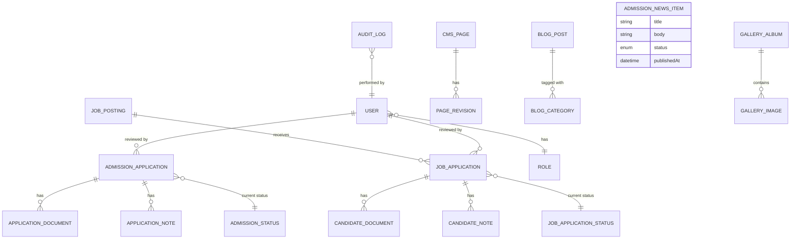
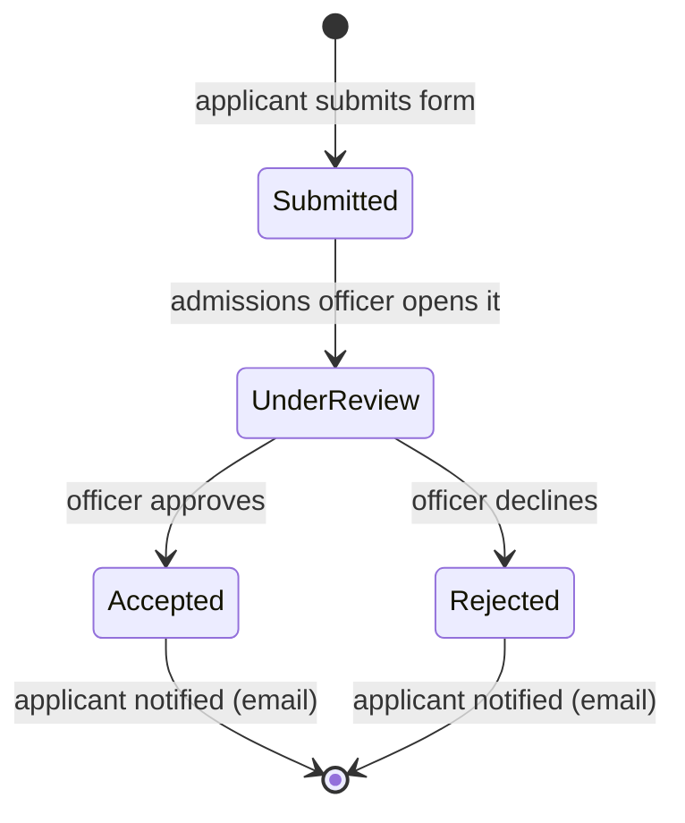
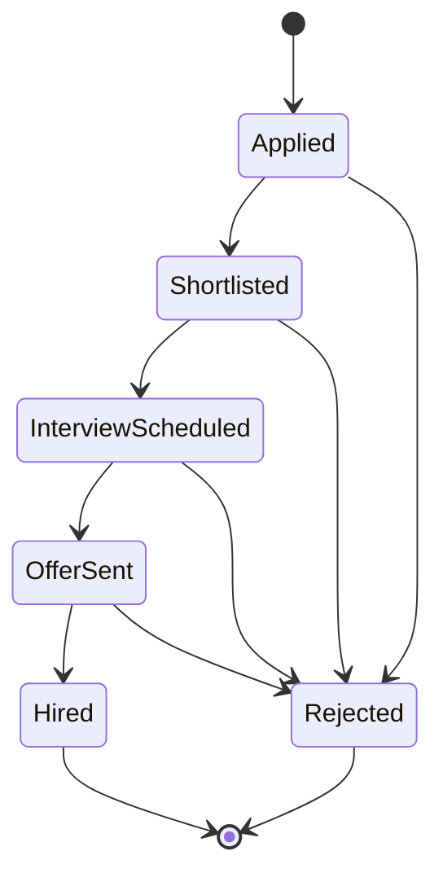
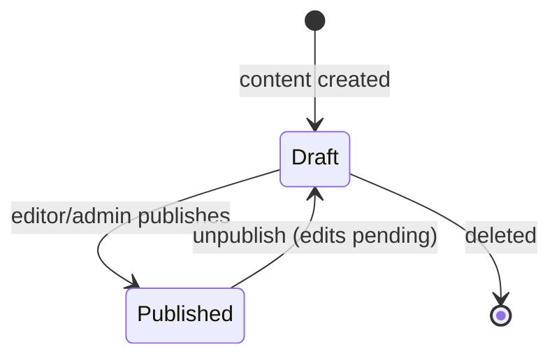
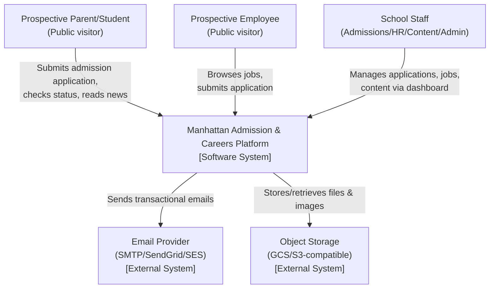
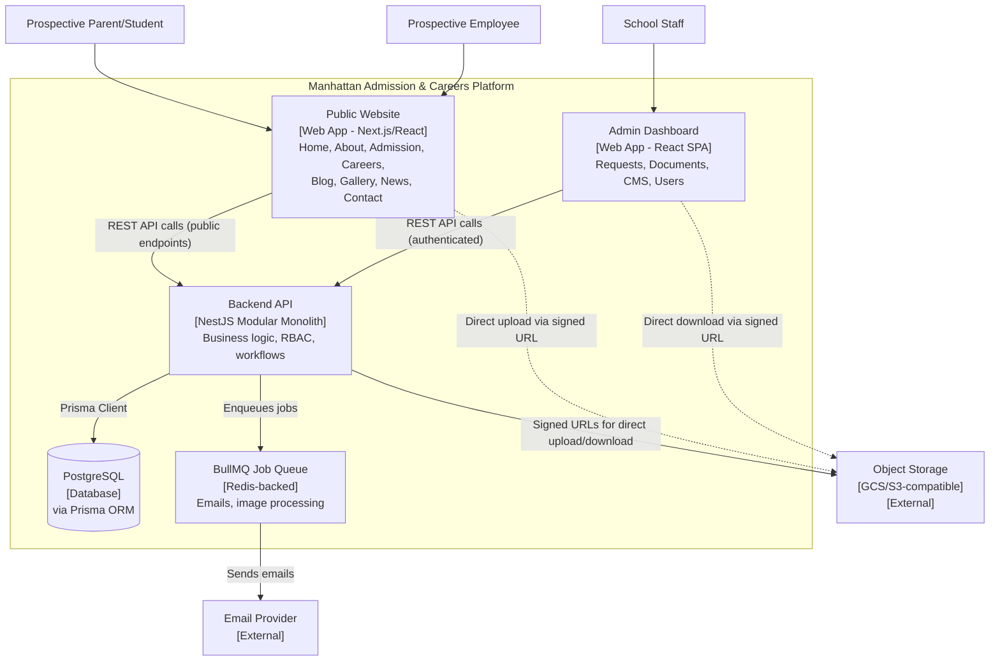
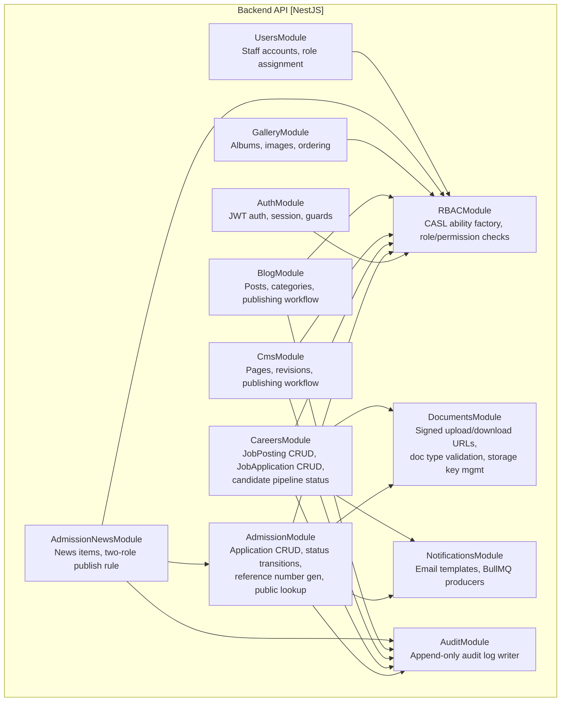
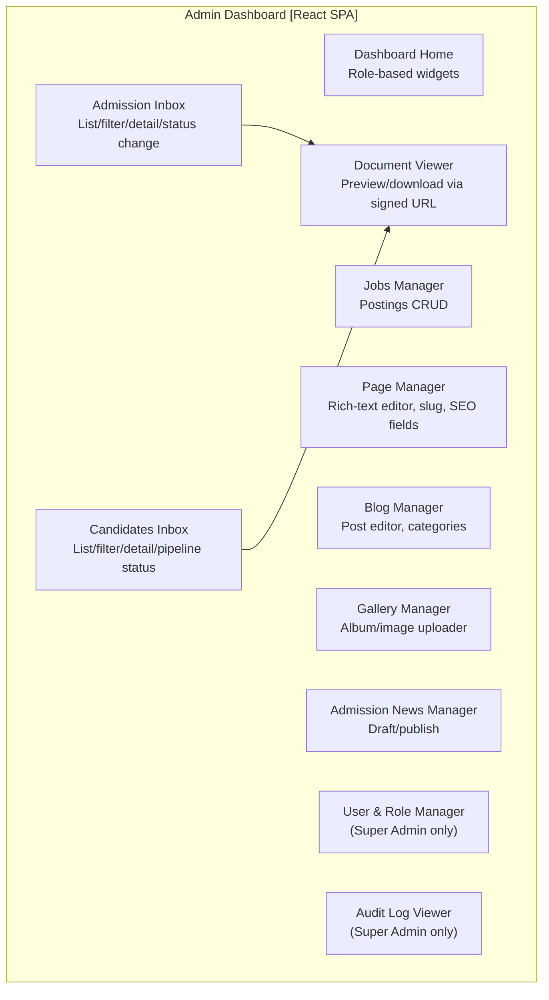

# Manhattan International School — Admission & Careers Platform
## Business & Technical Specification (BRD + Business Logic + C4 Architecture)

**Version:** 1.0
**Date:** 2026-07-30
**Prepared for:** Manhattan International School — Admission Website Project
**Stack:** NestJS (modular monolith) · PostgreSQL · Prisma · BullMQ · S3-compatible storage (GCS/S3) · CASL RBAC

---

## How to read this document

This is a single reference document combining three layers, top to bottom:

1. **Part 1 — BRD (Business Requirements Document):** what the system must do, for whom, and why.
2. **Part 2 — Business Logic & Domain Model:** the entities, state machines, and rules that govern behavior.
3. **Part 3 — C4 Architecture Model:** how the system is structured technically, from context down to components.
4. **Part 4 — Database schema outline** and **Part 5 — API surface summary** are included as an implementation bridge, following the same architectural conventions used on ARD Eval (modular monolith, RLS-free single-tenant here since this is a single school, CASL RBAC, BullMQ for async jobs).

---

# PART 1 — Business Requirements Document (BRD)

## 1. Executive Summary

Manhattan International School needs a public-facing website that serves two independent audiences — **prospective students/parents** (admission) and **prospective employees** (careers) — plus a content layer (pages, blog, gallery, news) that markets the school, and an **admin dashboard** that lets school staff manage all of the above without touching code.

The system is a **single-tenant** platform (one school, no multi-tenancy needed — unlike ARD Eval). This simplifies the data model considerably: no `Organization`/tenant scoping or Postgres RLS is required. Roles are scoped directly to users.

## 2. Project Objectives

- Let prospective students'/parents submit an admission application online, attach required documents, and track status.
- Let prospective employees browse open job postings and submit an application with a CV/documents.
- Give school staff a single admin dashboard to review, filter, and act on both types of submissions.
- Give school staff (marketing/content team) control over the public website's pages, blog, photo gallery, and an admission-focused news feed — without a developer.
- Keep the admission and careers pipelines **fully separate systems** (separate entities, statuses, and admin screens) since they serve different departments (Admissions Office vs. HR) and different data (student/guardian data vs. candidate/employment data).

## 3. Scope

### In Scope
- Public website: Home, About, Admissions info pages, Careers listing, Blog, Gallery, Admission News, Contact, static/dynamic CMS pages.
- Student Admission application flow (public form → submission → document upload → admin review → accept/reject decision → applicant notified).
- Careers/Jobs module: job postings management + public job application flow (separate from admission).
- Admin Dashboard: unified back-office for Admissions Officers, HR, Content Editors, and Super Admin.
- Document management: secure upload/storage/preview/download for both admission and job applicants.
- CMS: page builder/editor, blog authoring, gallery/album management, admission-news authoring.
- Role-based access control (RBAC) with 3–4 roles.
- Email notifications tied to status changes (submission received, decision made, etc.).

### Out of Scope (for this phase)
- Multi-school / multi-tenant support (explicitly single school for now; architecture should still avoid hard-coding assumptions that would block a future tenant column, but no RLS/tenant isolation work is done now).
- Student information system (grades, attendance, timetables) — this is admission-only, not a full SIS.
- Payment/tuition processing.
- Parent portal beyond application status tracking.

## 4. Stakeholders

| Stakeholder | Interest |
|---|---|
| Admissions Office | Review & decide on student applications, manage admission-related news |
| HR Department | Post jobs, review candidates, manage hiring status |
| Marketing/Content Team | Manage website pages, blog, gallery |
| Super Admin (IT/Management) | Full control: users, roles, all modules, site settings |
| Prospective Parents/Students | Submit applications, track status, read admission news |
| Prospective Employees | Browse jobs, apply |

## 5. User Roles & Permissions Matrix

Four roles, enforced via CASL-based RBAC (same approach as ARD Eval), scoped at the application level (no tenant scoping needed here):

| Capability | Super Admin | Admissions Officer | HR | Content Editor |
|---|:---:|:---:|:---:|:---:|
| Manage users & roles | ✅ | ❌ | ❌ | ❌ |
| Site settings | ✅ | ❌ | ❌ | ❌ |
| View/manage admission applications | ✅ | ✅ | ❌ | ❌ |
| Accept/reject admission applications | ✅ | ✅ | ❌ | ❌ |
| View/manage job postings | ✅ | ❌ | ✅ | ❌ |
| View/manage job applications | ✅ | ❌ | ✅ | ❌ |
| Manage CMS pages | ✅ | ❌ | ❌ | ✅ |
| Manage blog posts | ✅ | ❌ | ❌ | ✅ |
| Manage gallery/albums | ✅ | ❌ | ❌ | ✅ |
| Manage admission news | ✅ | ✅ (draft only) | ❌ | ✅ |
| Download applicant documents | ✅ | ✅ (admission docs only) | ✅ (job docs only) | ❌ |
| Audit log access | ✅ | ❌ | ❌ | ❌ |

> Note: Admissions Officer can *draft* admission news but Content Editor/Super Admin *publish* — this mirrors an editorial review step and is enforced in the publishing workflow (Part 2, §4).

## 6. Functional Requirements

### 6.1 Public Website
- **Home** — hero, highlights, CTA to Admission / Careers.
- **About** — CMS-managed static/dynamic pages (mission, facilities, faculty, etc.) — arbitrary number of pages, each with its own URL slug, managed by Content Editor.
- **Admission section** — informational pages (process, requirements, fees/tuition disclosure, FAQs) + the application form itself.
- **Careers section** — public job listing (filterable by department/type) + job detail page + apply form.
- **Blog** — general school blog (news, achievements, events) — categories, tags, featured image, publish/draft.
- **Gallery** — photo albums (e.g., "Sports Day 2026", "Science Fair") with cover image + image grid + lightbox.
- **Admission News** — **a distinct, narrower feed than the Blog**, showing only admission-related announcements (e.g., "Enrollment for 2026/2027 now open", "Open house date announced"). Written and published exclusively for the admission audience; separate content type from Blog even though the underlying CMS engine is shared.
- **Contact** — contact form + map/info (CMS-managed).

### 6.2 Student Admission Module
- Public multi-field application form: applicant/student info, guardian info, grade applying for, previous school, required document uploads (birth certificate, previous transcripts, ID/passport copy, photo).
- Confirmation email with a tracking reference upon submission.
- Public "check my application status" lookup (by reference number + email/phone).
- Admin: list/filter/search applications (by status, grade, date range), view full application + documents, change status, add internal notes, trigger notification email to applicant on decision.
- Simple workflow (per your decision): **Submitted → Under Review → Accepted / Rejected**.

### 6.3 Careers / Jobs Module (fully separate system)
- Admin (HR): create/edit/close job postings (title, department, type, description, requirements, deadline).
- Public: browse open postings, view detail, apply with CV upload + cover note + contact info.
- Admin (HR): list/filter candidates per job posting, view CV/documents, change candidate status (e.g., Applied → Shortlisted → Interview → Offered / Rejected — HR can define exact labels at setup, kept configurable since hiring pipelines vary more than admission ones), internal notes, email candidate.
- **This module does not share entities with the Admission module** — separate `JobPosting`/`JobApplication` tables, separate document bucket namespace, separate status enum, separate admin screens/permissions (HR vs. Admissions Officer).

### 6.4 Admin Dashboard
- Unified login for all staff roles; dashboard home shows role-relevant widgets (e.g., Admissions Officer sees "new applications this week"; HR sees "open positions / new candidates"; Content Editor sees "draft posts pending").
- **Requests management**: two independent inboxes — Admission Applications and Job Applications — each with list view, filters, status pipeline (kanban or status-filtered table), detail view, and document viewer.
- **Document control**: every document tied to its owning application (admission or job), with virus-safe upload flow, signed-URL preview/download, and retention policy fields (so old applicant documents can be purged later per data-retention policy).
- **CMS control**: page manager (create/edit/reorder/publish/unpublish arbitrary pages, each with slug + SEO fields), blog manager, gallery/album manager, admission-news manager.
- **User & role management** (Super Admin only).
- **Audit log** (Super Admin only) — who changed what status/content and when, consistent with Mohamed's investigative/compliance background — this is a lightweight append-only log, not a full compliance suite.

### 6.5 Content Management (Pages, Blog, Gallery, News)
- All four content types (Pages, Blog, Gallery, Admission News) share a common **Draft → Published** lifecycle, common SEO metadata fields (title, meta description, OG image), and common image-upload-to-storage flow — but are modeled as **separate tables**, not one generic "content" table, because their field shapes differ enough (a gallery is a set of images; a page has a rich-text body; news is short-form and admission-scoped) that a single polymorphic table would need excess nullable columns and complicate queries.

## 7. Non-Functional Requirements

- **Security**: signed upload URLs direct-to-storage (no file passes through the API server body, same pattern as ARD Eval); file type/size validation; rate-limiting on public form endpoints (anti-spam/anti-bot — consider a CAPTCHA on public forms).
- **Performance**: public site pages (Pages/Blog/Gallery/News) should be cacheable/CDN-friendly since they're read-heavy and low-churn.
- **Availability**: admin actions (status change, publish) should be synchronous; email sending and image processing (thumbnails) go through BullMQ as background jobs.
- **Auditability**: every status change and publish/unpublish action logged with actor + timestamp.
- **Localization**: content (Pages/Blog/News) should support bilingual fields (Arabic/English) at minimum for title/body, since the school markets to both audiences — confirm this if needed, currently assumed based on your usual project context.

---

# PART 2 — Business Logic & Domain Model

## 1. Domain Entities (conceptual ERD)



### Core entities

| Entity | Purpose | Key fields |
|---|---|---|
| `AdmissionApplication` | A student application | referenceNumber, studentName, dob, gradeAppliedFor, guardianName, guardianEmail, guardianPhone, previousSchool, status, submittedAt, reviewedBy, decisionAt |
| `ApplicationDocument` | Uploaded file for an admission application | applicationId, docType (birthCert/transcript/id/photo), storageKey, uploadedAt |
| `ApplicationNote` | Internal admin note on an application | applicationId, authorId, note, createdAt |
| `JobPosting` | An open role | title, department, employmentType, description, requirements, deadline, isOpen |
| `JobApplication` | A candidate's submission | jobPostingId, candidateName, email, phone, coverNote, status, appliedAt, reviewedBy |
| `CandidateDocument` | CV/portfolio for a job application | jobApplicationId, docType (cv/certificate/portfolio), storageKey |
| `CandidateNote` | Internal HR note | jobApplicationId, authorId, note |
| `User` | Staff account | name, email, roleId, isActive |
| `Role` | RBAC role | name (SuperAdmin/AdmissionsOfficer/HR/ContentEditor), permissions (CASL rules) |
| `CmsPage` | Arbitrary website page | slug, title, body (rich text), status (draft/published), seoTitle, seoDescription, ogImage |
| `BlogPost` | General blog article | slug, title, body, categoryId, featuredImage, status, publishedAt |
| `BlogCategory` | Blog taxonomy | name |
| `GalleryAlbum` | Photo album | title, coverImage, status |
| `GalleryImage` | Photo within an album | albumId, storageKey, caption, order |
| `AdmissionNewsItem` | Admission-only announcement | title, body, status (draft/published), publishedAt, authorId |
| `AuditLog` | Compliance trail | actorId, action, entityType, entityId, metadata, createdAt |

## 2. Admission Application — State Machine



**Rules:**
- An application cannot be created without at least the mandatory documents (configurable list — e.g., birth certificate + ID copy are required; transcript optional if grade < 1).
- Moving to `Accepted`/`Rejected` is only allowed from `UnderReview` (no skipping straight from `Submitted`), enforced at the service layer, not just the UI — this keeps an audit trail showing someone actually reviewed it.
- Every status transition writes an `AuditLog` row and enqueues a BullMQ job to email the applicant.
- `referenceNumber` is generated at submission (e.g., `ADM-2026-000123`) and is the applicant-facing lookup key — never expose the internal UUID/id publicly.

## 3. Job Application — State Machine

Kept intentionally more flexible than admission, since hiring pipelines vary by role — the status set is a configurable ordered list rather than a hardcoded enum, with three fixed anchor states (`Applied`, `Rejected`, `Hired`) and HR-configurable states in between (e.g., `Shortlisted`, `Interview Scheduled`, `Offer Sent`):



**Rules:**
- `JobPosting.isOpen = false` (deadline passed or manually closed) blocks new public submissions but existing candidates still move through the pipeline.
- Candidate status changes are HR-only; Admissions Officer role has zero visibility into this module (enforced at the RBAC layer, not just UI hiding — a curious officer must not be able to hit the API directly).

## 4. Content Publishing Workflow (Pages, Blog, Gallery, Admission News)



**Special rule for Admission News:** an Admissions Officer may create/edit a news item, but it stays in `Draft` until a Content Editor or Super Admin publishes it — this is the one place two roles touch the same entity, and it's enforced by a permission split (`create/update` vs `publish`) rather than a separate approval entity, to keep the model simple.

## 5. Notification Rules

| Trigger | Recipient | Channel |
|---|---|---|
| Admission application submitted | Applicant (guardian email) | Email — confirmation + reference number |
| Admission status → Accepted/Rejected | Applicant | Email |
| Job application submitted | Candidate | Email — confirmation |
| Job status changes | Candidate | Email (HR can choose to send or skip per stage — some internal stages like "Shortlisted" may not need candidate-facing email until later) |
| New admission application received | Admissions Officer(s) | In-app/dashboard notification (email optional) |
| New job application received | HR | In-app/dashboard notification |

All outbound emails go through a BullMQ queue (not sent synchronously in the request), matching the async pattern already used on ARD Eval.

## 6. Business Rules Summary

- Admission and Careers are **two independent pipelines** — no shared status enum, no shared document bucket path, no shared admin screen. Only the underlying auth/RBAC/audit-log infrastructure is shared.
- Admission News is a distinct content type from Blog — same CMS engine, different table, different public route (`/news` limited to admission announcements vs `/blog` for general content), and a two-role publishing rule for it.
- File uploads always go direct-to-storage via signed URL; the API only stores the resulting `storageKey`, never the file bytes.
- All public-facing forms (admission apply, job apply, contact) should have basic anti-spam protection (rate limit + honeypot/CAPTCHA) since they're unauthenticated write endpoints.

---

# PART 3 — C4 Architecture Model

## Level 1 — System Context



## Level 2 — Containers



## Level 3 — Component Diagram: Backend API (NestJS Modular Monolith)



**Notes:**
- `AdmissionModule` and `CareersModule` are structurally parallel but **do not depend on each other** — enforcing the "fully separate systems" decision at the code level, not just the data level.
- `NewsMod --> AdmissionMod` reflects only the *editorial* dependency (Admissions Officer can draft news) — not a data dependency; it's a permission relationship resolved through `RBACModule`, not a foreign key.
- `DocumentsModule` is shared infrastructure (signed URL generation, virus/type scanning) but every document row still stores which owning module/entity it belongs to — the module doesn't hold admission or job data itself.

## Level 3 — Component Diagram: Admin Dashboard (React SPA)



## Tech Stack Decisions

| Layer | Choice | Rationale |
|---|---|---|
| Backend | NestJS modular monolith | Consistent with your established pattern (ARD Eval); simpler than microservices for this scope |
| ORM | Prisma | Same as ARD Eval; strong TypeScript DX |
| DB | PostgreSQL | Relational integrity for applications/status/audit; no PostGIS needed here (no geo data, unlike ARD Eval) |
| Queue | BullMQ (Redis) | Async email sending, image thumbnail generation |
| Storage | GCS or S3-compatible | Direct-to-storage signed uploads, same pattern as ARD Eval |
| RBAC | CASL | Reuse the ability-factory pattern from ARD Eval, scoped to 4 fixed roles instead of tenant-scoped roles |
| Frontend (public site) | Next.js/React (SSR/SSG recommended) | Public pages are read-heavy/SEO-sensitive (Blog, News, Careers listing) — SSR/SSG improves SEO and load time versus a pure SPA |
| Frontend (admin) | React SPA | Internal tool, no SEO concern, SPA is simplest |
| Multi-tenancy | **None** — single tenant | Confirmed single-school scope; no RLS/tenant-scoping overhead needed, unlike ARD Eval |

---

# PART 4 — Database Schema Outline (Prisma-style, abbreviated)

```prisma
enum AdmissionStatus {
  SUBMITTED
  UNDER_REVIEW
  ACCEPTED
  REJECTED
}

enum ContentStatus {
  DRAFT
  PUBLISHED
}

enum StaffRole {
  SUPER_ADMIN
  ADMISSIONS_OFFICER
  HR
  CONTENT_EDITOR
}

model AdmissionApplication {
  id               String            @id @default(uuid())
  referenceNumber  String            @unique
  studentName      String
  dateOfBirth      DateTime
  gradeAppliedFor  String
  guardianName     String
  guardianEmail    String
  guardianPhone    String
  previousSchool   String?
  status           AdmissionStatus   @default(SUBMITTED)
  reviewedById     String?
  reviewedBy       User?             @relation(fields: [reviewedById], references: [id])
  submittedAt      DateTime          @default(now())
  decisionAt       DateTime?
  documents        ApplicationDocument[]
  notes            ApplicationNote[]
}

model JobPosting {
  id             String           @id @default(uuid())
  title          String
  department     String
  employmentType String
  description    String
  requirements   String
  deadline       DateTime?
  isOpen         Boolean          @default(true)
  applications   JobApplication[]
}

model JobApplication {
  id             String              @id @default(uuid())
  jobPostingId   String
  jobPosting     JobPosting          @relation(fields: [jobPostingId], references: [id])
  candidateName  String
  email          String
  phone          String
  coverNote      String?
  status         String              @default("APPLIED") // configurable pipeline
  reviewedById   String?
  reviewedBy     User?               @relation(fields: [reviewedById], references: [id])
  appliedAt      DateTime            @default(now())
  documents      CandidateDocument[]
  notes          CandidateNote[]
}

model User {
  id        String    @id @default(uuid())
  name      String
  email     String    @unique
  role      StaffRole
  isActive  Boolean   @default(true)
  createdAt DateTime  @default(now())
}

model CmsPage {
  id              String        @id @default(uuid())
  slug            String        @unique
  title           String
  body            String
  status          ContentStatus @default(DRAFT)
  seoTitle        String?
  seoDescription  String?
  ogImage         String?
  updatedAt       DateTime      @updatedAt
}

model AdmissionNewsItem {
  id           String        @id @default(uuid())
  title        String
  body         String
  status       ContentStatus @default(DRAFT)
  authorId     String
  publishedAt  DateTime?
  createdAt    DateTime      @default(now())
}

model AuditLog {
  id         String   @id @default(uuid())
  actorId    String
  action     String
  entityType String
  entityId   String
  metadata   Json?
  createdAt  DateTime @default(now())
}
```

*(BlogPost, BlogCategory, GalleryAlbum, GalleryImage, ApplicationDocument, CandidateDocument, ApplicationNote, CandidateNote follow the same conventions and are omitted here for brevity — happy to expand any of them into full Prisma models on request.)*

---

# PART 5 — API Surface Summary

| Module | Public Endpoints | Admin Endpoints |
|---|---|---|
| Admission | `POST /admission/apply`, `GET /admission/status/:ref` | `GET /admin/admissions`, `GET /admin/admissions/:id`, `PATCH /admin/admissions/:id/status`, `POST /admin/admissions/:id/notes` |
| Careers | `GET /careers/jobs`, `GET /careers/jobs/:id`, `POST /careers/jobs/:id/apply` | `POST /admin/jobs`, `PATCH /admin/jobs/:id`, `GET /admin/jobs/:id/candidates`, `PATCH /admin/candidates/:id/status` |
| Documents | `POST /uploads/signed-url` (scoped to application) | `GET /admin/documents/:id/signed-url` |
| CMS Pages | `GET /pages/:slug` | `POST/PATCH/DELETE /admin/pages` |
| Blog | `GET /blog`, `GET /blog/:slug` | `POST/PATCH/DELETE /admin/blog` |
| Gallery | `GET /gallery`, `GET /gallery/:albumId` | `POST/PATCH/DELETE /admin/gallery` |
| Admission News | `GET /news`, `GET /news/:id` | `POST/PATCH /admin/news` (draft), `POST /admin/news/:id/publish` (Content Editor/Super Admin only) |
| Users | — | `GET/POST/PATCH /admin/users` (Super Admin only) |
| Audit | — | `GET /admin/audit-log` (Super Admin only) |

---

## Open Questions for Next Iteration

- Bilingual content (Arabic/English) — confirm if `CmsPage`/`BlogPost`/`AdmissionNewsItem` need parallel language fields or a separate translations table.
- Exact list of mandatory documents per grade level for admission (affects validation rules).
- Whether the public "check my application status" lookup needs OTP/phone verification to prevent reference-number guessing.
- Anti-spam approach for public forms (reCAPTCHA vs. custom honeypot).
